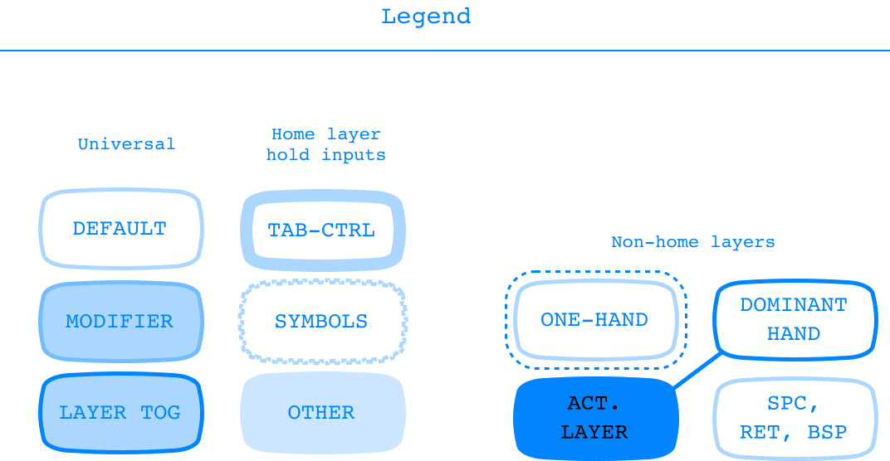
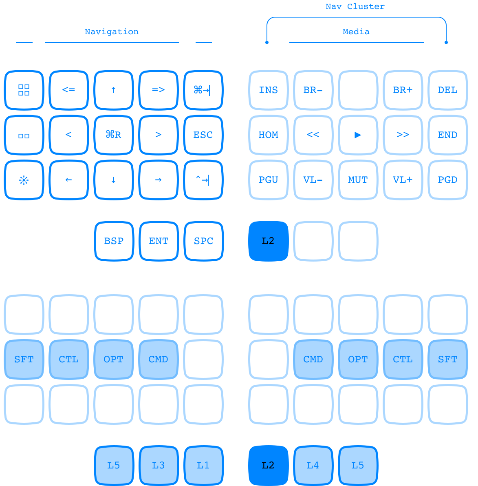
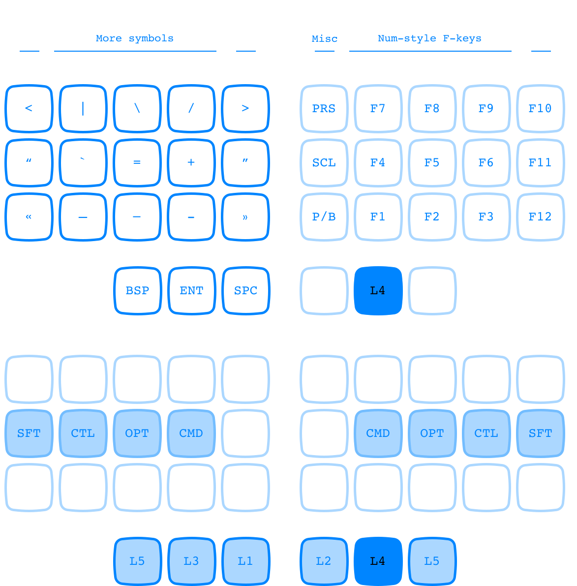

# Pictura Keyboard Layout Manual

Pictura is a ergonomic keyboard layout compatible with devices running the ZMK keyboard firmware.

For all information on how ZMK works, how to use this layout, how to edit it, and so on, see the official [ZMK documentation](https://zmk.dev/docs).


## At a glance…

A couple of things you should know before using this firmware for yourself:

- It's a 36-key layout made with a wireless [Microdox](https://boardsource.xyz/store/5f2e7e4a2902de7151494f92) in mind. Since the Microdox has has a very retracted thumb-cluster, I treat the innermost key as the primary thumb key. It might be best to edit the keymap and swap this inner key with the middle thumb key for something like a Corne.


- For commands with no dedicated ZMK key-code (e.g. navigate back and forward on webpages), I'm using shortcuts combos that work on my personal machine, but which will need to be customized for other devices. See the layout legend below if ever you're confused about what these shortcuts in the .keymap file are supposed to actually do.

How does this layout compare to the popular 36-key [Miryoku layout](https://github.com/manna-harbour/miryoku/tree/master/docs/reference)? With the understanding that this is a much less fully-featured project put together by someone with no programming experience with only my own personal use in mind, here are nonetheless the crucial advantages for me: 

  - Tap-Shift for more effortless typing, with the additional option of a traditional hold-shift in the form of a home-row mod.
  - Tab-control on home-layer… in fact in general [there's just more that's accessible on the home layer](#layer-0).
  - One-handed layers for mouse-friendly use, with the additional option of two-handed use of the same inputs when that's more ergonomic.
  - DVORAK alphas with optional [QWERTY command shortcuts](#layer-3).


## Layer 0

Top set of keys display tap inputs, bottom set of keys display hold inputs.


The following graphical key explains basic input types for both the home layer (layer 0) and other layers.



Further explanation for layer 0:

- `T1` - `T0` input `command-1` - `command-0` for switching to tabs in browsers, IDEs, etc.
- `SFT`, `CTL` etc. are home row mods. Anyone who has tried to implement home row mods knows they can take quite a bit of configuration. Among other things, these parameters work wonders for me:
	- Mods don't trigger if a key has been pressed in the last 100ms, which prevents triggering during fast typing in general.
	- Left mods will more easily trigger when paired with right key taps. This minimized accidental triggers during rolling.

Other legend abbreviations:

- `CLP` Displays clipboard history (`CTRL + OPT + CMD + V` on my machine)
- `CPL` Caps Lock

## Layer 1


On non-home keys, inputs are carefully coordinated with their layer toggle key in four different ways:

1. The left hand of layer 1 is duplicated on the left hand of layer 2. This allows nav inputs to be used both in the more ergonomic two-handed mode via layer 2 (right hand toggles layer, left hand presses nav input) as well as in one-handed mode when the my right hand is resting on a mouse.
2. QWERTY commands on layer 3 are also mouse-friendly one-handed, but no two-handed version of them exists as I use them less often.
3. Inputs which are frequently used but are not susceptible to being used with a mouse are two-handed only (num pad, symbols…).
4. Finally, inputs which are not used often and are also not susceptible to being used with the mouse are relegated to right-only one-handed use.

Legend abbreviations:

- `↖↑↗` mission control
- `<<<`  `>>>` switch between screens
- `^` `v` `<` `>` arrow cluster 
- `<==` `==>` go back and forward

## Layer 2



## Layer 3

The QWERTY-commands on this layer are purely optional; Dvorak commands can of course be used on the home layer thanks to home-row mods.


## Layer 4



## Layer 5

This layer is reserved for hardware-level inputs, such as reseting the controller or switching devices.


Legend abbreviations:

- `FLS` put controller in bootloader mode for flashing
- `RST` reset controller
- `BTC` bluetooth clear profile
- `BT0` send inputs to bluetooth device 0


## All layers


<!--

## Legend

Anything marked as `HOLD` only outputs the specified keypress when the key is held down for a longer amount of time than a regular tap, generally a minimum 120 milliseconds.

### All layers

- `HOLD` home-row: mods
- `HOLD` thumb-cluster: layers

### Layer 0 (Home)

- **alpha block**:         DVORAK
- `HOLD` **alpha top row**:     tab-control
- `HOLD` **alpha bottom row**:  frequent symbol

```
,-----.-----.-----.-----.-----.   TAP    ,-----.-----.-----.-----.-----.
|  '  |  ,  |  .  |  P  |  Y  |          |  F  |  G  |  C  |  R  |  L  |
|-----+-----+-----+-----+-----|          |-----+-----+-----+-----+-----|
|  A  |  O  |  E  |  U  |  I  |          |  D  |  H  |  T  |  N  |  S  |
|-----+-----+-----+-----+-----|          |-----+-----+-----+-----+-----|
|  ;  |  Q  |  J  |  K  |  X  |          |  B  |  M  |  W  |  V  |  Z  |
`-----'-----'-----'-----'-----'          `-----'-----'-----'-----'-----'
      ,-------.-------.-------.          ,-------.-------.-------.      
      |  BRT  |  BSP  |  SFT  |          |  SPC  |  TAB  |  VOL  |      
      `-------'-------'-------'          `-------'-------'-------'      

,-----.-----.-----.-----.-----.   HOLD   ,-----.-----.-----.-----.-----.
|  T1 |  T2 |  T3 |  T4 |  T5 |          |  T6 |  T7 |  T8 |  T9 |  T0 |
|-----+-----+-----+-----+-----|          |-----+-----+-----+-----+-----|
| SFT | CTL | ALT | GUI | APS |          | MSN | GUI | ALT | CTL | SFT |
|-----+-----+-----+-----+-----|          |-----+-----+-----+-----+-----|
|  !  |  ?  |  (  |  )  | ESC |          | CPL |  -  |  [  |  {  |  /  |
`-----'-----'-----'-----'-----'          `-----'-----'-----'-----'-----'
      ,-------.-------.-------.          ,-------.-------.-------.      
      |  MO5  |  MO3  |  MO1  |          |  MO2  |  MO4  |  MO5  |      
      `-------'-------'-------'          `-------'-------'-------'      
```

- Home-row mods imitate the order of mods on a macbook.
  - GUI: Command in macOS, windows key in Windows
  - ALT: Option in macOS
- `T1`, `T2` etc. : Select tab 1, select tab 2, etc. `Cmd-1`, `Cmd-2` etc. in macOS.
  - T9 selects the last tab in many browsers and some other applications.
  - T0 sets the zoom to 100% in some applications (Preview.app, for example).
- For hold inputs, the innermost keys of the bottom two rows comprise a separate section of their own. I think of it as a my home-layer navigation cluster:
  - APS: Uses the MacOS App Switcher to switch to the previous application. You can achieve the same thing with `Cmd-Tab`; this option is mouse friendly since it only requires the left hand, but is only practical for switching to the most recent app on the app switcher.
  - MSN: Mission control on MacOS (`Opt-Up`)
  - CPL: Caps Lock
- `MO1` etc. : Activate layer 1 when pressed down


### Layer 1

- **Left**:  navigation cluster (one-handed)
- **Right**: number pad

```
,-----.-----.-----.-----.-----.   TAP    ,-----.-----.-----.-----.-----.
|     | <<< |  ^  | >>> |     |          |  ,  |  7  |  8  |  9  |  0  |
|-----+-----+-----+-----+-----|          |-----+-----+-----+-----+-----|
| CLP |  <  |  v  |  >  |     |          |  .  |  4  |  5  |  6  | RET |
|-----+-----+-----+-----+-----|          |-----+-----+-----+-----+-----|
|     | <== |     | ==> |     |          |  *  |  1  |  2  |  3  |     |
`-----'-----'-----'-----'-----'          `-----'-----'-----'-----'-----'
      ,-------.-------.-------.          ,-------.-------.-------.      
      |       |       |  XXX  |          |  SPL  |   0   |       |      
      `-------'-------'-------'          `-------'-------'-------'      

,-----.-----.-----.-----.-----.   HOLD   ,-----.-----.-----.-----.-----.
|     |     |     |     |     |          |     |     |     |     |     |
|-----+-----+-----+-----+-----|          |-----+-----+-----+-----+-----|
| SFT | CTL | ALT | GUI |     |          |     | GUI | ALT | CTL | SFT |
|-----+-----+-----+-----+-----|          |-----+-----+-----+-----+-----|
|     |     |     |     |     |          |     |     |     |     |     |
`-----'-----'-----'-----'-----'          `-----'-----'-----'-----'-----'
      ,-------.-------.-------.          ,-------.-------.-------.      
      |       |       |  XXX  |          |       |       |       |      
      `-------'-------'-------'          `-------'-------'-------'      
```

- `<` `>` `^` `v` : left, right, up, down
- `<<<` `>>>`: swipe left and right between fullscreen apps in macOS, `Opt-left` and `Opt-right`
- `CLP`: Clipboard history — this is a shortcut configured in a third party app, `Cmd-Opt-Ctrl-V`
    `<==`: Back, `Cmd-leftBracket`
- `==>`: Forward, `Cmd-rightBracket`
- `SPL`: Spotlight search, `Cmd-Space` — the goal here is to reproduce similar thumb movements to what one would make hitting `Cmd-Space` on a mac

### Layer 2

- **Left**:  navigation cluster (two-handed use)
- **Right**: media

```
,-----.-----.-----.-----.-----.   TAP    ,-----.-----.-----.-----.-----.
|     | <<< |  ^  | >>> |     |          |  << |  ⏵︎  |  >> | ⏐<< | >>| |
|-----+-----+-----+-----+-----|          |-----+-----+-----+-----+-----|
| CLP |  <  |  v  |  >  |     |          | MUT | VL- | VL+ | BR- | BR+ |
|-----+-----+-----+-----+-----|          |-----+-----+-----+-----+-----|
|     | <== |     | ==> |     |          |     |     |     |     |     |
`-----'-----'-----'-----'-----'          `-----'-----'-----'-----'-----'
      ,-------.-------.-------.          ,-------.-------.-------.      
      |       |       |       |          |  XXX  |       |       |      
      `-------'-------'-------'          `-------'-------'-------'      

,-----.-----.-----.-----.-----.   HOLD   ,-----.-----.-----.-----.-----.
|     |     |     |     |     |          |     |     |     |     |     |
|-----+-----+-----+-----+-----|          |-----+-----+-----+-----+-----|
| SFT | CTL | ALT | GUI |     |          |     | GUI | ALT | CTL | SFT |
|-----+-----+-----+-----+-----|          |-----+-----+-----+-----+-----|
|     |     |     |     |     |          |     |     |     |     |     |
`-----'-----'-----'-----'-----'          `-----'-----'-----'-----'-----'
      ,-------.-------.-------.          ,-------.-------.-------.      
      |       |       |       |          |  XXX  |       |       |      
      `-------'-------'-------'          `-------'-------'-------'      
```

- `MUT`: Mute
- `VL`: Volume
- `BR`: Brightness


### Layer 3

- **Left**:  QWERTY-commands (one-handed)
- **Right**: symbols 1

```
,-----.-----.-----.-----.-----.   TAP    ,-----.-----.-----.-----.-----.
| C-Q | C-W | C-E | C-R | C-O |          |  (  |  &  |  *  |  `  |  )  |
|-----+-----+-----+-----+-----|          |-----+-----+-----+-----+-----|
| C-A | C-S | C-D | C-F | C-N |          |  {  |  $  |  %  |  ^  |  }  |
|-----+-----+-----+-----+-----|          |-----+-----+-----+-----+-----|
| C-Z | C-X | C-C | C-V | C-M |          |  [  |  !  |  @  |  #  |  ]  |
`-----'-----'-----'-----'-----'          `-----'-----'-----'-----'-----'
      ,-------.-------.-------.          ,-------.-------.-------.      
      |       |  XXX  |       |          |       |       |       |      
      `-------'-------'-------'          `-------'-------'-------'      

,-----.-----.-----.-----.-----.   HOLD   ,-----.-----.-----.-----.-----.
|     |     |     |     |     |          |     |     |     |     |     |
|-----+-----+-----+-----+-----|          |-----+-----+-----+-----+-----|
| SFT | CTL | ALT | GUI |     |          |     | GUI | ALT | CTL | SFT |
|-----+-----+-----+-----+-----|          |-----+-----+-----+-----+-----|
|     |     |     |     |     |          |     |     |     |     |     |
`-----'-----'-----'-----'-----'          `-----'-----'-----'-----'-----'
      ,-------.-------.-------.          ,-------.-------.-------.      
      |       |  XXX  |       |          |       |       |       |      
      `-------'-------'-------'          `-------'-------'-------'      
```

- `C-Q`, `C-W`, etc. : Cmd-Q, Cmd-W etc. All but the innermost column are QWERTY commands. The inner column doesn't correspond to QWERTY, but instead pulls frequently used commands which, in QWERTY, are under to right hand (O, N, and M).


### Layer 4

- **Left**: symbols 2
- **Right**: function keys

```
,-----.-----.-----.-----.-----.   TAP    ,-----.-----.-----.-----.-----.
|  <  |  |  |  \  |  /  |  >  |          |     | F7  | F8  | F9  | F10 |
|-----+-----+-----+-----+-----|          |-----+-----+-----+-----+-----|
|  “  |  ”  |  «  |  »  |  €  |          |     | F4  | F5  | F6  | F11 |
|-----+-----+-----+-----+-----|          |-----+-----+-----+-----+-----|
| em– | en— |  -  |  +  |  =  |          |     | F1  | F2  | F3  | F12 |
`-----'-----'-----'-----'-----'          `-----'-----'-----'-----'-----'
      ,-------.-------.-------.          ,-------.-------.-------.
      |       |       |       |          |       |  XXX  |       |
      `-------'-------'-------'          `-------'-------'-------'

,-----.-----.-----.-----.-----.   HOLD   ,-----.-----.-----.-----.-----.
|     |     |     |     |     |          |     |     |     |     |     |
|-----+-----+-----+-----+-----|          |-----+-----+-----+-----+-----|
|     |     |     |     |     |          |     | GUI | ALT | CTL | SFT |
|-----+-----+-----+-----+-----|          |-----+-----+-----+-----+-----|
|     |     |     |     |     |          |     |     |     |     |     |
`-----'-----'-----'-----'-----'          `-----'-----'-----'-----'-----'
      ,-------.-------.-------.          ,-------.-------.-------.      
      |       |       |       |          |       |  XXX  |       |      
      `-------'-------'-------'          `-------'-------'-------'      
```

- `€`: in macOS `Opt-Sft-2`
- `en–`: en-dash `Opt-Dash`
- `em-`: em-dash `Opt-Sft-Dash`

### Layer 5

Controller commands

```
,-----.-----.-----.-----.-----.   TAP    ,-----.-----.-----.-----.-----.
|     |     | FLS | RST |     |          |     | RST | FLS |     |     |
|-----+-----+-----+-----+-----|          |-----+-----+-----+-----+-----|
| BTC | BT2 | BT1 | BT0 |     |          |     | BT0 | BT1 | BT2 | BTC |
|-----+-----+-----+-----+-----|          |-----+-----+-----+-----+-----|
|     |     |     |     |     |          |     |     |     |     |     |
`-----'-----'-----'-----'-----'          `-----'-----'-----'-----'-----'
      ,-------.-------.-------.          ,-------.-------.-------.      
      |  XXX  |       |       |          |       |       |  XXX  |      
      `-------'-------'-------'          `-------'-------'-------'      

,-----.-----.-----.-----.-----.   HOLD   ,-----.-----.-----.-----.-----.
|     |     |     |     |     |          |     |     |     |     |     |
|-----+-----+-----+-----+-----|          |-----+-----+-----+-----+-----|
|     |     |     |     |     |          |     |     |     |     |     |
|-----+-----+-----+-----+-----|          |-----+-----+-----+-----+-----|
|     |     |     |     |     |          |     |     |     |     |     |
`-----'-----'-----'-----'-----'          `-----'-----'-----'-----'-----'
      ,-------.-------.-------.          ,-------.-------.-------.      
      |  XXX  |       |       |          |       |       |  XXX  |      
      `-------'-------'-------'          `-------'-------'-------'     
```

  - Firmware
    - `FLS` Flash (bootloader mode)
    - `RST` Reset 
  - Bluetooth
    - `BT0` etc. Select profile 
    - `BTC` Clear profile

-->