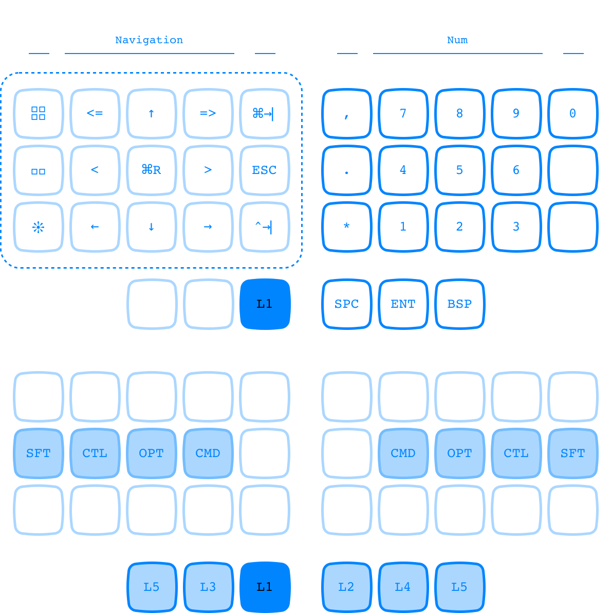

# 36-QUI 

`36-QUI` is a 36-key ergonomic keyboard layout compatible with devices running the ZMK keyboard firmware.

For details on what devices are compatible with ZMK, how to use this layout, how to edit it, and so on, see the [ZMK documentation](https://zmk.dev/docs).

## At a glance…

A few things to know before using `36-QUI`:

- It is a work in progress!
- This layout is made with a wireless [Microdox](https://boardsource.xyz/store/5f2e7e4a2902de7151494f92) in mind. Since the Microdox has a retracted thumb-cluster, I treat the innermost key as the primary thumb key. It might be best to edit the .keymap file and swap this inner key with the middle thumb key for something like a Corne.

- For commands with no dedicated ZMK key-code, I'm calling key combos which work on my personal machine, but which will need to be customized for other devices (e.g. `Cmd-Opt-Ctrl-V` for clipboard history). See the layout legend below to confirm what these macros in the .keymap file are supposed to actually do.
- The home layer is currently Dvorak, but of course this is not essential to the config's core features and can be changed.

How does this layout compare to the popular 36-key [Miryoku layout](https://github.com/manna-harbour/miryoku/tree/master/docs/reference)? With the understanding that this is obviously a much less fully-featured project put together by someone with no programming experience and with only my own personal use in mind, here are nonetheless the crucial advantages for me: 

  - Sticky shift for more effortless typing, with the additional option of a traditional hold shift in the form of a home-row mod.
  - Tab-control on home-layer… in fact in general [there's just more that's conveniently accessible directly from the home layer](#layer-0).
  - One-handed layers for mouse-friendly use, with the additional option of two-handed use of the same inputs when that's more ergonomic.
  - DVORAK alphas with optional [QWERTY command shortcuts](#layer-3).

## All layers

All layers have the following inputs in common:

- home row modifiers
- thumb cluster space, return, and backspace

Individual layers are documented further down.

## Layer 0

Top set of keys display tap inputs, bottom set of keys display hold inputs (+120ms for most keys).

Further explanation for layer 0:

- `T1` - `T0` input `command-1` - `command-0` for effortlessly switching to tabs in browsers, IDEs, etc.
- `SFT`, `CTL` etc. are home row mods. Anyone who has tried to implement home row mods knows they can take quite a bit of complex tweaking. I have implemented mine more or less along the lines of [urob’s “timerless” configuration](https://github.com/urob/zmk-config#timeless-homerow-mods).
- The symbols on the home layer are purely for convenience and are redundant: these symbols can also be accessed on dedicated symbol layers 3 and 4.

Other legend abbreviations:

- `CLB` Clipboard history (`CTRL + OPT + CMD + V` on my machine)
- `SPL` Spotlight / Alfred / Raycast etc. (`CTRL + Space` on my machine)
- `CPL` Caps Lock

## Layer 1

On non-home layers, inputs are carefully coordinated with their layer's toggle key in four different ways:

1. The left hand of layer 1 is duplicated on the left hand of layer 2. This allows nav inputs to be used both in the more ergonomic two-handed mode via layer 2 (right hand toggles layer, left hand presses nav input) as well as in one-handed mode via layer 1 when my right hand is resting on a mouse.
2. QWERTY commands on layer 3 are also mouse-friendly one-handed, but no two-handed version of them exists as I use them less often.
3. Inputs which are frequently used but are not susceptible to being used with a mouse are two-handed only (num pad, symbols…).
4. Finally, inputs which are not used often and are also not susceptible to being used with the mouse are relegated to right-only one-handed use.

Legend abbreviations:

- `<<<`  `>>>` navigate between screens
- `↖↑↗` mission control
- `↔` switch between active app windows
- `⇆` switch between two most recent apps
- `<=` `=>` navigate backward and forward on webpages, indent text
- `↻` Reload webpage
- `^` `v` `<` `>` arrow cluster

## Layer 2

## Layer 3

The QWERTY-commands on this layer are purely optional; Dvorak commands can of course be used on the home layer thanks to home-row mods.

The symbols on layer 3 are matched with the numbers on layer 1 in the same way that symbols and numbers are matched in Dvorak and QWERTY.

## Layer 4

## Layer 5

This layer is reserved for hardware-level inputs, such as reseting the controller or switching devices.

Legend abbreviations:

- `FLS` put controller in bootloader mode for flashing
- `RST` reset controller
- `BTC` clear bluetooth profile
- `BT0` connect to bluetooth device 0